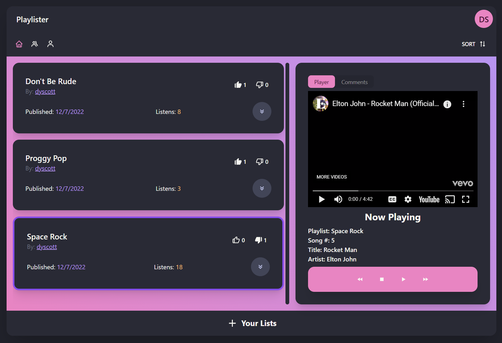

# Playlister
A web app for creating, sharing, and listening to playlists. Built with React, Express, GraphQL, and MongoDB. 

This was originally a class project for my Fundamentals of Software Development class and could only be run locally, but I have since adapted it to be deployed to Vercel and MongoDB Atlas. You can find my deployment [here](https://playlister.dyscott.xyz/).



## Features
- Authentication: Playlister implements simple authentication using JSON Web Tokens. Users can sign up, log in, and log out securely.
- Playlists: Users can create, edit, and delete playlists. Playlists can be published to the public or be kept private. Public playlists can no longer be edited but can be duplicated by anyone to create a modified version.
- Music Player: Playlister has a built-in music player that can play songs from YouTube.
- Undo / Redo: Users can undo and redo changes to their playlists which is implemented using a transaction processing system.
- Search: Users can search for playlists by name or by the name of the user who created it.
- Reactions: Users can react to playlists with a like or dislike. Users can also comment on playlists.

## Implementation

### Frontend
The frontend of Playlister is built using React, along with the following libraries:
- [zustand](https://github.com/pmndrs/zustand) for state management
- [React Query](https://github.com/TanStack/query) and [graphql-request](https://github.com/jasonkuhrt/graphql-request) for data fetching
- [React Router](https://github.com/remix-run/react-router) for routing
- [daisyUI](https://github.com/saadeghi/daisyui) and [Tailwind CSS](https://tailwindcss.com/) for styling
- [react-youtube](https://github.com/tjallingt/react-youtube) for the YouTube player

### Backend
The backend of Playlister is built using Express, along with the following libraries:
- [GraphQL.js](https://github.com/graphql/graphql-js) and [graphql-http](https://github.com/graphql/graphql-http) for the GraphQL API
- [mongoose](https://github.com/Automattic/mongoose) for interacting with MongoDB

## Running Locally
To run Playlister locally, you will need to have Node.js and MongoDB installed. You will also need to change the `MONGODB_URI` environment variable in `.env` to point to your local MongoDB instance and the `JWT_SECRET` environment variable to a random string.

Once you have done that, you can run the following commands to start the development servers:
```bash
npm install
npm install -g nodemon

npm run server # Backend
npm run dev # Frontend, run in a separate terminal
```
Then, navigate to `localhost:3000` in your browser to view the app.

Deploying to Vercel should also be fairly simple, just fork the repository, setup a Vercel project, and set the `MONGODB_URI` and `JWT_SECRET` environment variables in the Vercel dashboard. You can use MongoDB Atlas for the database or any other MongoDB hosting service.